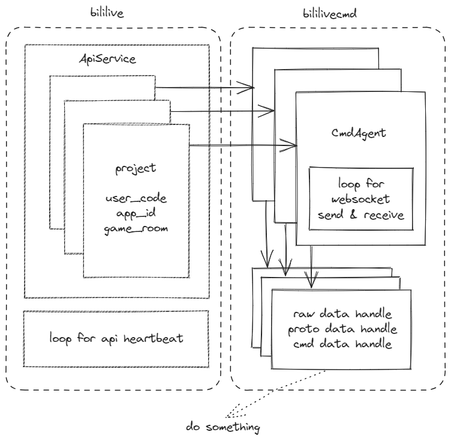

# bilirs

[Bilibili open-live](https://open-live.bilibili.com) SDK by Rust

[bilirs](https://github.com/zerocraft/bilirs)

## 功能

- API

    项目开启

    项目关闭

    项目心跳（服务自动执行）

    项目批量心跳（服务自动执行）

- 长连CMD

    AUTH包

    发送心跳（代理自动执行）

    获取弹幕信息（已解析）

    获取礼物信息（已解析）

    获取付费留言（已解析）

    付费留言下线（已解析）

    付费大航海（已解析）

    点赞信息（已解析）

## 使用

### 安装

``` shell
cargo add bililivex
```

基础使用方法

``` rust
// 测试代码 bililive/src/lib.rs - mod tests

// 使用AccessKey和Secret建立服务
let mut service = ApiService::new(Auth::new(env_access_key(), env_access_secret()));
// 使用直播code和app_id开启项目，在启动服务后会自动按频率发送心跳
// 认证成功同时还会创建一个长连接代理（可独立工作）
let mut agent = service
    .new_project(env_live_code(), env_app_id())
    .await
    .unwrap();
// 为长连接代理添加处理对象 （可选择性 是否需要处理层 或 多个处理层） raw -> proto -> cmd
let handle = Arc::new(TestHandler::default());
// // 处理原始字符串
// let raw = Arc::clone(&handle);
// //
// agent.raw_handles.lock().await.push(raw);
// // 处理proto对象
// let op = Arc::clone(&handle);
// agent.op_handles.lock().await.push(op);
// 处理弹幕消息包（Proto.Operation==5）
let cmd = Arc::clone(&handle);
agent.cmd_handles.lock().await.push(cmd);
// 启动长连接代理
agent.start().await;
// 启动服务（用于自动发送项目心跳）,正常退出时会自动调用end api
service.service_start().await;
```

参考Handle实现

``` rust
#[derive(Default)]
pub struct TestHandler;

#[async_trait]
impl LiveCmdHandleRAW for TestHandler {
    async fn handle(&self, bytes: Vec<u8>, _params: CmdAgentParams) {
        println!("LiveCmdHandleRAW {:?}", bytes);
    }
}

#[async_trait]
impl LiveCmdHandleOP for TestHandler {
    async fn handle(&self, proto: RawProto, _params: CmdAgentParams) {
        println!("LiveCmdHandleOP {:?}", proto);
    }
}

#[async_trait]
impl LiveCmdHandle for TestHandler {
    async fn handle_dm(&self, cmd: CDM, _params: CmdAgentParams) {
        println!("handle_dm {:?}", cmd);
    }
    async fn handle_send_gift(&self, cmd: CSendGift, _params: CmdAgentParams) {
        println!("handle_send_gift {:?}", cmd);
    }
    async fn handle_super_chat(&self, cmd: CSuperChat, _params: CmdAgentParams) {
        println!("handle_super_chat {:?}", cmd);
    }
    async fn handle_super_chat_del(&self, cmd: CSuperChatDel, _params: CmdAgentParams) {
        println!("handle_super_chat_del {:?}", cmd);
    }
    async fn handle_guard(&self, cmd: CGuard, _params: CmdAgentParams) {
        println!("handle_guard {:?}", cmd);
    }
    async fn handle_like(&self, cmd: CLike, _params: CmdAgentParams) {
        println!("handle_like {:?}", cmd);
    }
}
```

## 架构



## 鸣谢

kuangzilin
